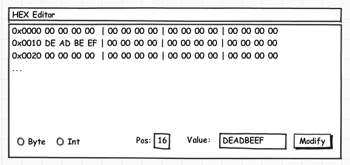
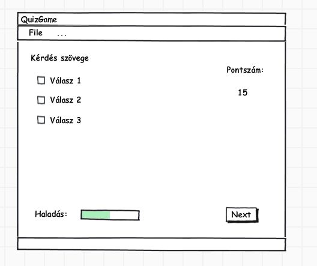

# GUI Kiegészítés #

## Listenerek egyéb megvalósításai##
Saját listener megvalósítása:

	public class GUI1 {
	    private final JButton ok = new JButton("Ok");
	    
	    private class OkButtonActionListener implements ActionListener {
	        @Override
	        public void actionPerformed(ActionEvent e) {
	            System.out.println("Ok pressed");
	        }
	    }
	    
	    public GUI1() {
	        OkButtonActionListener listener = new OkButtonActionListener();
	        ok.addActionListener(listener);
	    }
	}

vagy maga az osztály implementálja az interfészt, mindenre rá lehet aggatni,
majd `setActionCommand()` ill. `getActionCommand()` függvény használható a
megkülönböztetésre:

	public class GUI2 implements ActionListener {
	    private final JButton ok = new JButton("Ok");
	    private final JButton cancel = new JButton("Ok");
	    
	    private final String OK_COMMAND     = "ok";
	    private final String CANCEL_COMMAND = "cancel";
	    
	    public GUI2() {
	        ok.addActionListener(this);
	        ok.setActionCommand(OK_COMMAND);
	        
	        cancel.addActionListener(this);
	        cancel.setActionCommand(CANCEL_COMMAND);
	    }
	    
	    public void actionPerformed(ActionEvent e) {
	        if (OK_COMMAND.equals(e.getActionCommand())) {
	            System.out.println("Ok pressed");
	        } else if (CANCEL_COMMAND.equals(e.getActionCommand())) {
	            System.out.println("Cancel oressed");
	        }
	    }
	}

## Komplexebb grafikus felület##
Containerekkel (`Panel`, `JPanel`).

TODO: kép

## JOptionPane ##
Ha `super != null`, akkor modális, pl.:

	JFrame frame = ...;
	...
	JOptionPane.showMessageDialog( frame, "Modalis uzenet");

## MVC ##
Model-View-Controller. Egyes GUI komponensek nem direkt módon tárolják az
adatokat (többféle reprezentáció), ilyenkor modelleket kell használni (pl.
`JProgressBar`, `JNumberSpinner`, `JTable`, stb.). Példa:

	int val = progressBar.getModel().getValue();
	progressBar.getModel().setValue(++val);

## BorderLayout ##
Használatra példa:

	JPanle panel = new JPanel( new BorderLayou() );
	
	panel.add( new JLabel("North"),  BorderLayout.NORTH  );
	panel.add( new JLabel("South"),  BorderLayout.SOUTH  );
	panel.add( new JLabel("East"),   BorderLayout.EAST   );
	panel.add( new JLabel("West"),   BorderLayout.WEST   );
	panel.add( new JLabel("Center"), BorderLayout.CENTER );

## CardLayout ##
Példa:

	final static String APANEL = "Panel 1";
	final static String BPANEL = "Panel 2";
	
	JPanel card1 = new JPanel();
	JPanel card2 = new JPanel();
	
	CardLayoult layout = new new CardLayout();
	cards = new JPanel( layout );
	cards.add(card1, APANEL);
	cards.add(card2, BPANEL);
	
	layout.show(cards, APANEL );
	layout.show(cards, BPANEL );
	
	layout.first(cards);
	layout.last(cards);

## JRadioButton##
`ButtonGroup` használata kell, ha szeretnénk, hogy egyszerre csak választható ki közülül:

	JRadioButton button1 = new JRadioButton("A");
	JRadioButton button2 = new JRadioButton("B");
	
	ButtonGroup group = new ButtonGroup();
	group.add( button1 );
	group.add( button2 );

## JFileChooser ##
Használatnál figyeljünk a visszatérési értékre!

	final JFileChooser fc = new JFileChooser();
	...
	int ret = fc.showOpenDialog( frame );
	if ( JFileChooser.APPROVE_OPTION == ret ) {
	    ...
	}

## Feladatok ##
### Hex editor ###
Készíts egy egyszerű hexadecimális szövegszerkesztőt! Egy sorban 16 karakter
legyen, amely az egyes bájtok értékeit reprezentálják. A program kínáljon
lehetőséget `byte`, `int` módosításra, adott pozíción, megadott értékkel. A 
szövegmezőn keresztüli szerkesztés legyen letiltva (`setEnabled(false)`). Ha
megnyomják a modify gombot, akkor az adott értéket írjuk ki a file-ba
(`RandomAccessFile` segítségével) a megadott pozícióra, és frissítsük a
szövegmező tartalmát!

**Képernyőterv** - Hex editor

### Kvíz alkalmazás ###
Készítsünk egy egyszerű kvíz-alkalmazást, amely az alábbi típusú kérdéseket
tartalmazhatja:

* Eldöntendő kérdés, pl.:

		Hány fia volt Ádámnak a Biblia szerint?
		( ) 2
		( ) 3
		(*) 33

* Kiválasztós, pl.:

		Mely országok határosak Magyarországgal?
		[x] Szerbia
		[x] Szlovénia
		[ ] Japán

Minden kérdésben 3-3 lehetőség van. Ezeket fájlból olvassuk, inicializálás
során. A formátuma a következő:

		C:Hany versszakbol all a himnusz?:4:6:8:false:false:true
		S:Mely szamok primek?:1:2:7:false:true:true
		...

Az inputban `:` karakterrel elválasztva 8 mező található, ezek jelentések a
következő:

* Az első karakter megmondja, hogy milyen típusú kérdés adatait tartalmazza az
  adott sor. `C` = eldöntendő, `S` = kiválasztós kérdés
* A kérdés szövege
* A lehetséges 3 válasz
* A válaszok helyessége

A játék képernyőterve az alábbi ábrán található.

**Képernyőterv** - Kvíz alkalmazás

A program a következő funkciókat biztosítsa:

* Egyszerre 5 kérdést adjon
* Lehessen menüből kilépni, valamint új játékot kezdeni (ezekre kérjen
  megerősítést a program!)
* A program jelezze a teszt kitöltöttségét egy `JProgressBar` segítségével
* Pontozás: minden jól megválaszolt eldöntendő kérdés 10 pont. Minden eltalált
  kiválasztós kérdés 5 pont.
* A játék végén írjon ki egy gratuláló üzenetet, amely tartalmazza, hány pontot
  ért el a felhasználó

> **Példakérdések** <http://people.inf.elte.hu/legendi/java/res/questions.txt>

#### További lehetőségek ####
* Játékot lehessen elmenteni, betölteni! (memento)
* Egyszer lehessen segítséget kérni egy `'?'` gombbal! Ha használtuk, tiltsuk le
  a gombot.
* A végén meg lehessen nézni az eredményeket. Itt színes labelekkel jelezzük,
  hogy sikerült az adott kérdést teljesíteni (zöld - OK, piros - Fail,
  sárga - skip).
