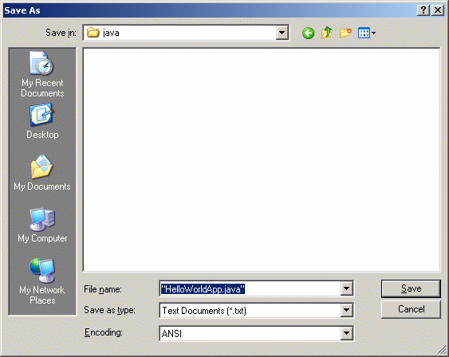
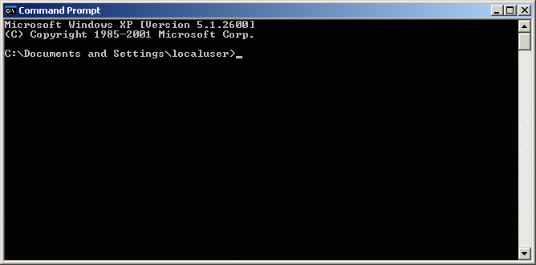
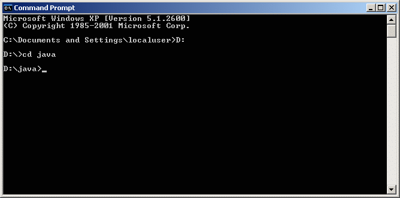
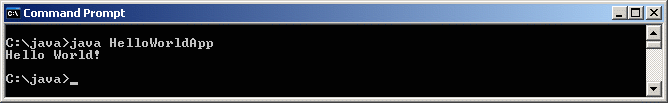

# "Hello World!" Microsoft Windowson#

> **Megjegyzés** Az alábbi fejezetetek a Java Tutorial egy bevezető fejezetének (kissé átdolgozott) magyar fordítását tartalmazza. A fordítást köszönjük Szabó Balázsnak!
> <http://download.oracle.com/javase/tutorial/getStarted/cupojava/win32.html>

Itt az ideje, hogy megírd az első alkalmazásod! A most következő utasítások Windows XP Professional, Windows XP Home, Windows Server 2003, Windows 2000 Professional, és Windows Vista használóknak szól. Más platformokhoz leírást a ["Hello World!" for Solaris OS and Linux](http://download.oracle.com/javase/tutorial/getStarted/cupojava/unix.html) és ["Hello World!" for the NetBeans IDE](http://download.oracle.com/javase/tutorial/getStarted/cupojava/netbeans.html) cikkekben találsz.

Ha problémákba ütközöl, vess egy pillantást a következő fejezetre, ahol a gyakoribb hibákat és magyarázatukat találod.

## Tartalom ##

* Szükséges szoftverek 
* Első alkalmazás létrehozása 
	* Forrás fájl létrehozása 
	* Fordítsd le a forrásfájlt `.class` formátumra 
	* A program futtatása

## Szükséges szoftverek ##
Hogy megírd az első programod, szükséged lesz az alábbiakra:

1. Java SE Development Kit 6 (JDK 6) 
Innen letöltheted a Windowsos verziót (a JDK-t töltsd le, ne a JRE-t): <http://www.oracle.com/technetwork/java/javase/downloads/index.html>.
Kövesd a telepítési utasításokat: <http://www.oracle.com/technetwork/java/javase/index-137561.html>
2. Szövegszerkesztő
Ebben a leírásban a Notepad alkalmazást fogjuk használni, amely minden Windows platformon megtalálható, de bármilyen más szövegszerkesztő is használható. 
Mindössze ennyi szükséges ahhoz, hogy megírd az első programod.

## Első alkalmazás létrehozása ##
Első alkalmazásod `HelloWorldApp` névre hallgat, és annyit csinál, hogy kiírja a `"Hello world!"` üdvözlő szöveget a képernyőre. Ehhez az alábbiak szükségesek:

* Hozz létre egy forrásfájlt
A forrásfájl Java nyelven írott kódot tartalmaz, amit te és más programozók megértenek. Bármilyen szövegszerkesztőt használhatsz, hogy létrehozd, vagy szerkeszd. 
* A forrásfájl `.class` fordítása formátumra
A *fordító* (`javac`, mint *Java compiler*) a forrásfájlban lévő szöveget a gép számára érthető utasításokra alakítja. Az így előállított fájl tartalma az ún. bytecode.
* A program futtatása
A futtató alkalmazás (`java`) indítja el a virtuális gépet, ami értelmezi a bytecode-ot, és futtatja az alkalmazást.

### Forrásfájl létrehozása ###
Itt két lehetőséged van:

* Elmented a `HelloWorldApp.java` a gépedre, ezzel sok gépelést megspórolsz: <http://download.oracle.com/javase/tutorial/getStarted/application/examples/HelloWorldApp.java>. Utána folytathatod a következő fejezettel.
* Vagy követed az utasításokat :-)

Indítsd el a szövegszerkesztőt. A Notepad alkalmazást a *Start menüből* indíthatod el. Egy új dokumentumba írd be az alábbiakat:

	/**
	 * The HelloWorldApp class implements an application that
	 * simply prints "Hello World!" to standard output.
	 */
	class HelloWorldApp {
	    public static void main(String[] args) {
		System.out.println("Hello World!"); // Display the string.
	    }
	}

> **Megjegyzés** Minden kódot, utasítást és fájlnevet pontosan másolj le. Mind a futtató (`java`), mind a fordító alkalmazás (`javac`) megkülönbözteti a kis-, és nagybetűket. 
> `HelloWorldApp != helloworldapp`

Mentsd el a kódot `HelloWorldApp.java` néven. Ehhez válaszd a *Fájl &rarr; Mentés másként* menüelemet, majd:

1. A Fájlnév mezőbe írd be, hogy `"HelloWorldApp.java"`, az idézőjeleket is.
2. A Fájl típusának állítsd be az egyszerű szöveges formátumot: *Text Documents (\*.txt)*.
3. A Kódolás legördülő menüben legyen *ANSI* kiválasztva.

Miután végeztél így kell kinéznie:

**Ábra** A *Mentés másként* dialógusablak, közvetlenül a *Mentés* gomb megnyomása előtt
 
Ments, és lépj ki a Notepad alkalmazásból!

### A forrásfájl `.class` fordítása formátumra ###
Indítsd el a parancsértelmezőt (`cmd.exe`), ehhez a *Start menüben* kattints a futtatásra, és írd be `"cmd"`. Ennek az ablaknak így kell kinéznie.
 

**Ábra** Parancsértelmező ablak
 
A parancsértelmező mutatja az *aktuális könyvtárat*. Ez alapértelmezés szerint általában a felhasználó saját könyvtára (*home directory*), mint a képen is látható egy Windows XP esetén.

Hogy lefordítsd a forrásfájlt, lépj be abba a könyvtárba, ahova a fájlt mentetted. Például ha ez a könyvtár a `C:` meghajtón lévő `java` könyvtár, akkor a következő utasítással teheted ezt meg:

	$ cd C:\java

Az aktuális könyvtárad most a `C:\java`, amelyet a parancsértelmező *prompt* is jelez.

> **Megjegyzés** Ahhoz, hogy meghajtót válts, szükség van egy másik utasításra is: a meghajtó nevére. Például ha a `D:` meghajtón lévő `java` könyvtárba tudj váltani, írd be a megható nevét és egy `":"` karaktert. Például: 
 

**Ábra** Másik meghajtóra váltás 
 
Ha beírod a `dir` parancsot, láthatod a forrás fájlt, ahogy azt az alábbi ábra is mutatja.
 

**Ábra** Mappa tartalmának listázása
 
Most már készen állsz a fordításra. Ehhez a következőt kell begépelned:  

	$ javac HelloWorldApp.java

A fordító létrehozta a bytecode állományt, egy `HelloWorldApp.class` fájlt. A `dir` paranccsal hatására látható is a megjelenő listán az állományok között.
 

**Ábra** Könyvtár lista, amely tartalmazza a generált `class` fájlt
 
Most már futtathatod a programot. 
Ha problémákba ütköztél, vess egy pillantást a következő fejezetre, ahol a gyakoribb hibákat és magyarázatukat találod.

### A program futtatása ###
Gépeld be a következő parancsot abban a könyvtárban, ahol az alkalmazásod található:

	$ java HelloWorldApp

A lenti képen találhatod az eredményt.
 

**Ábra** A program eredménye
 
A program kiírja a `"Hello World!"` üzenetet.

Gratulálunk! Működik a program!

Ha problémákba ütköztél, vess egy pillantást a következő fejezetre, ahol a gyakoribb hibákat és magyarázatukat találod.

# #

